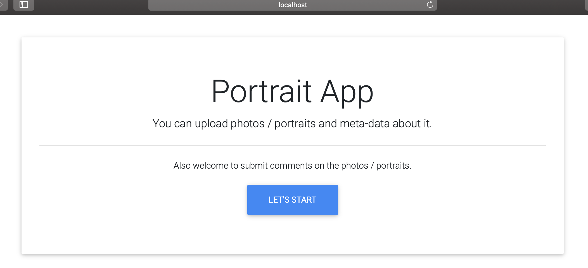

# go-gui
Go REST API backend served with HTML + Jquery frontend 

  
# Installation

Dependency is managed with golang dep [https://github.com/golang/dep]

``` 
cd $HOME
git clone https://github.com/vinodborole/go-gui.git

export GOPATH=$HOME/go-gui

cd $HOME/go-gui/src/app
dep ensure

cd $HOME/go-gui/scripts
sh build.sh

```
# Execute

Execution will automatically open the browser with the home page of the application - http://localhost:8100/static/index.html
```
cd $HOME/go-gui/bin
./app

```
 
# Demo


 
